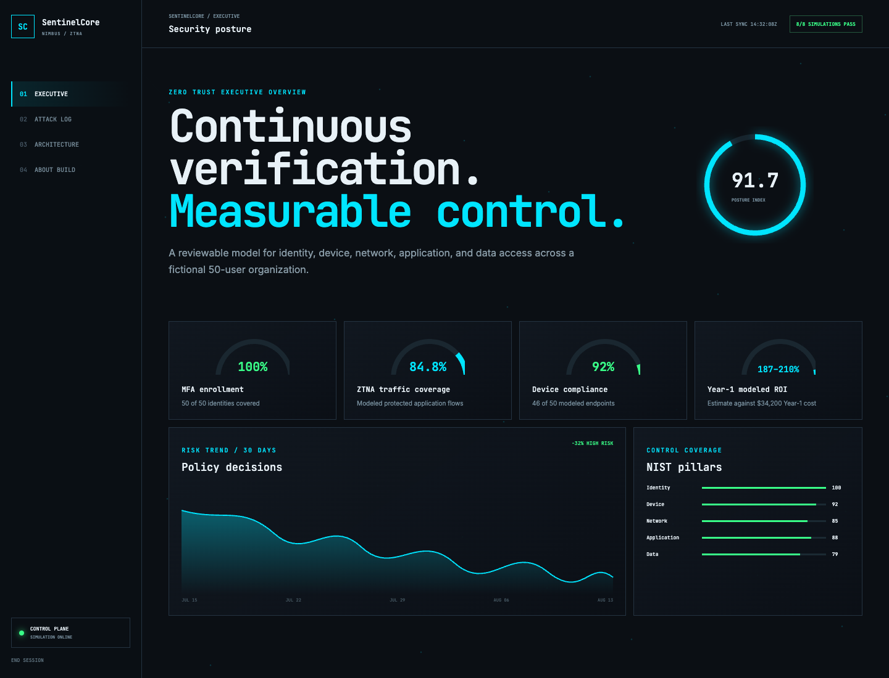
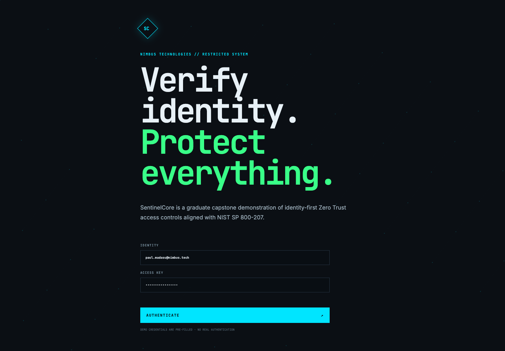
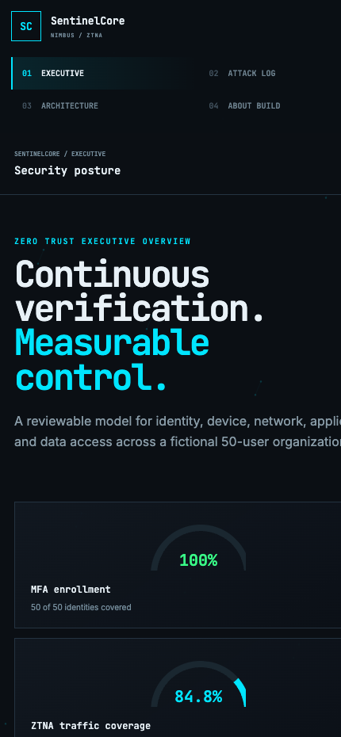

# SentinelCore Zero Trust Architecture

> Identity-first Zero Trust architecture, policy-as-code, detection engineering, and response playbooks for a 50-user SME.



The terminal-style login accepts only the documented demo credentials and is explicitly labeled as simulated authentication.



## 1. Overview

SentinelCore is an implementation-ready security architecture aligned with NIST SP 800-207. It connects Entra ID Conditional Access, least-privilege RBAC, Defender and Sentinel telemetry, Cloudflare access signals, KQL detections, and identity-response playbooks.

## 2. Security objective

The repository demonstrates how a small organization can replace network-based trust with explicit decisions based on identity, device, risk, application sensitivity, and session context.

## 3. Scope and status

This is a portfolio reference architecture and control simulation. Policy documents, KQL rules, validation tooling, and response playbooks are implemented as code; no production tenant is modified.

## 4. Security cockpit

The multi-view dashboard covers executive posture, an 8/8 authorized simulation log, five NIST-aligned pillars, and a first-person capstone explanation. The MFA, ZTNA coverage, compliance, Year-1 cost, and ROI figures are documented modeled inputs, not production measurements.



## 5. Architecture

Review [docs/ARCHITECTURE.md](docs/ARCHITECTURE.md) for the policy, enforcement, telemetry, detection, and response flow.

## 6. Zero Trust principles

- Verify explicitly using identity, device, location, risk, and resource context
- Use least privilege and time-bound elevation
- Assume breach and preserve investigation evidence
- Continuously evaluate sessions and revoke when risk changes
- Measure control coverage rather than assuming deployment equals protection

## 7. Conditional Access policy set

[`policies/conditional-access.json`](policies/conditional-access.json) contains administrator MFA, legacy-authentication blocking, risk-based challenges, and compliant-device controls. Every non-block policy includes emergency-access exclusions.

## 8. Privileged access model

[`policies/rbac-matrix.json`](policies/rbac-matrix.json) demonstrates narrow scopes, eligible role activation, and approvals for privileged access.

## 9. Detection engineering

The `detections/` directory contains KQL for impossible travel, token-replay indicators, and privileged-role drift. Each rule is intended to be tuned against authorized tenant telemetry before deployment.

## 10. Incident response

The [session-revocation playbook](playbooks/session-revocation.md) covers validation, containment, identity recovery, persistence review, clean sign-in verification, and stakeholder communication.

## 11. Threat model

Review [docs/THREAT_MODEL.md](docs/THREAT_MODEL.md) for assets, threats, trust boundaries, and required security properties.

## 12. Control matrix

The [control matrix](docs/CONTROL_MATRIX.md) maps objectives to controls, evidence, and honest implementation status.

## 13. Automated validation

```bash
python3 scripts/validate_controls.py
```

The validator checks unique policy IDs, allowed states, emergency exclusions, approved eligible privilege, and substantive detection coverage.

## 14. Automated screenshots

```bash
bash scripts/capture_screenshots.sh
```

Headless Chrome regenerates desktop and mobile images in `docs/screenshots/`.

## 15. Continuous integration

GitHub Actions validates JSON, control relationships, KQL coverage, Python execution, and Bash syntax on each push and pull request.

## 16. Interview discussion points

- Why two emergency accounts are excluded and heavily monitored
- Difference between authentication strength and authorization scope
- How report-only Conditional Access reduces deployment risk
- When session revocation is appropriate and what must be verified afterward
- How a detection becomes a reliable operational decision

## 17. Roadmap

- Add Terraform modules for a disposable Azure security lab
- Add Defender for Cloud recommendations and device-compliance simulation
- Map controls to CIS Microsoft 365 and Azure benchmarks
- Add detection test fixtures and expected alert outcomes
- Add a tabletop exercise with a complete incident timeline

## 18. License

Released under the [MIT License](LICENSE).
