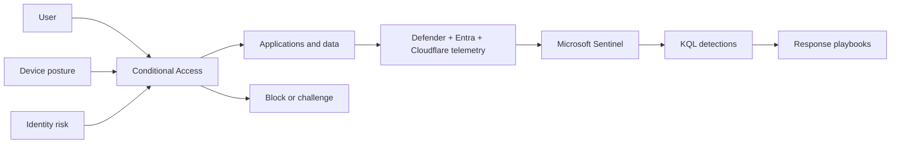

# Zero Trust Architecture

The design follows NIST SP 800-207 principles: no implicit trust based on network location, continuous evaluation, least privilege, explicit policy enforcement, and telemetry-driven improvement.

