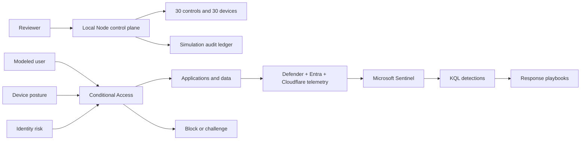

# Zero Trust Architecture

The design follows NIST SP 800-207 principles: no implicit trust based on network location, continuous evaluation, least privilege, explicit policy enforcement, and telemetry-driven improvement.

The local service exposes posture, control, device, and simulation endpoints. Posture is calculated from versioned evidence records rather than hard-coded dashboard labels. Reviewer sessions live in memory and authorized simulation executions are written to an ignored runtime file. The GitHub Pages build reads the immutable JSON directly and disables persistence honestly.

No route deploys or changes cloud controls. The policy, KQL, and playbook artifacts are reference inputs that require tenant-specific testing, approvals, licensing, and staged rollout before production use.
